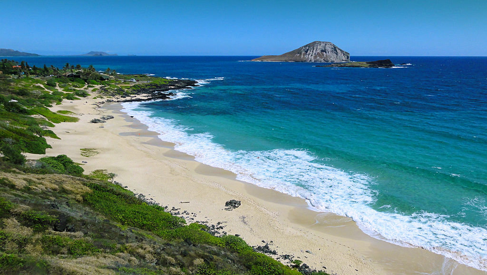

# Oahu Climate Analysis

## Project Overview
Before W.Avy can invest into the Waves and Ice Cream venture he would like you to run an analysis and gather information about seasonal data of Oahu to determine if the weather could affect the Waves and Ice Cream shop.

## Resources
- Jupyter notebook file
- SQLite database
- VS Code
- Flask

## Objectives
- Explain the structures, interactions, and types of data of a provided dataset.
- Differentiate between SQLite and PostgreSQL databases.
- Use SQLAlchemy to connect to and query a SQLite database.
- Use statistics like minimum, maximum, and average to analyze data.
- Design a Flask application using data.

## Instructions
- Design a query to retrieve the month of precipitation data and plot the results. Starting from the first data point in the database.
-  Write a function called calc_temps that will accept start date and end date in the format '%Y-%m-%d' and return the minimum, average, and maximum temperatures for that range of dates for June 2016, June 2017, December 2016, and December 2017

## Background
## Project Overview
## Resources
## Data Source
## Machine Learning Model
## Findings and Recommendation
